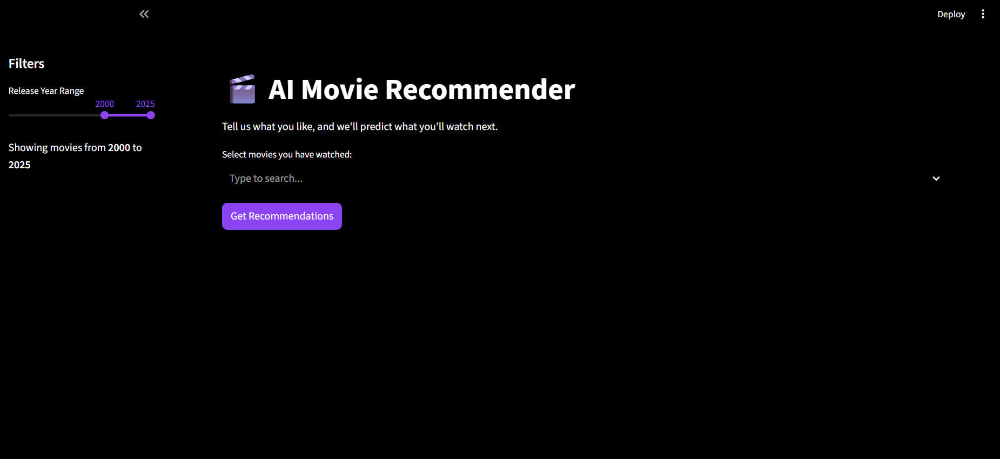
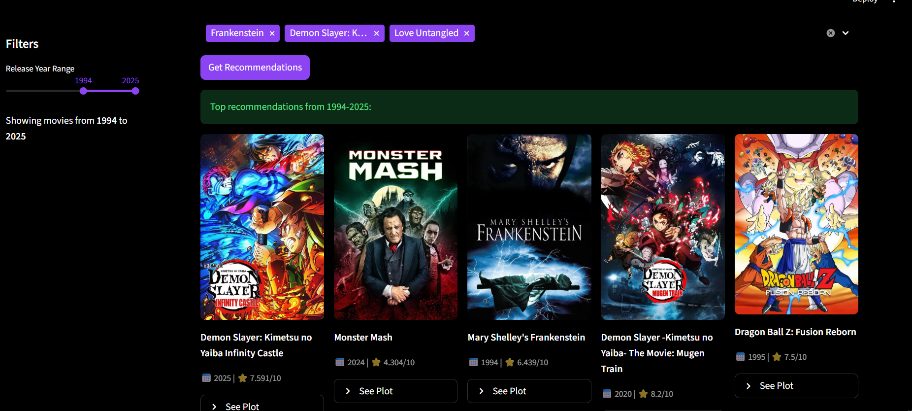
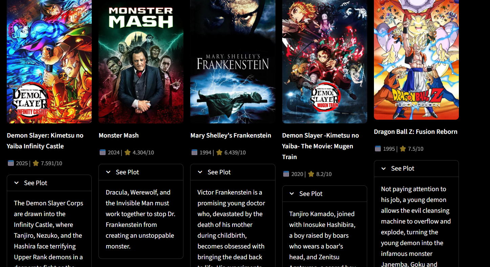

# 🎬 AI-Powered Movie Recommender System


An end-to-end **Content-Based Recommendation Engine** that suggests movies based on the semantic similarity of their plot summaries. Unlike simple popularity-based systems, this application uses **Vector Embeddings** and **Cosine Similarity** to understand a user's specific taste profile.

## 🎯 Project Overview & Goals

The primary goal of this project was to engineer a complete machine learning pipeline, moving from raw data extraction to a user-facing frontend. It solves the **"Cold Start"** problem by allowing users to select a set of movies they like to generate immediate recommendations without historical data.

**Key Technical Concepts Implemented:**
* **ETL Pipeline:** extracting structured and unstructured data from the TMDB API.
* **Vector Search (NLP):** Converting textual plot summaries into 384-dimensional vectors using `Sentence-Transformers` (BERT-based models).
* **User Profiling:** Implementing a **Vector Averaging** algorithm to create a dynamic "User Taste Vector" based on multiple inputs.
* **Interactive UI:** Building a real-time dashboard with **Streamlit**.

## ⚙️ System Architecture

1.  **Data Ingestion:** The system fetches metadata (Title, Genre, Release Date, Plot) for 1,000+ popular movies via the TMDB API.
2.  **Embedding Generation:** The `all-MiniLM-L6-v2` transformer model converts the natural language "Overview" of each movie into a dense vector representation.
3.  **Recommendation Logic:**
    * When a user selects multiple movies (e.g., *Matrix* + *Inception*), the system calculates the **Mean Vector (Centroid)** of these selections.
    * It then performs a **Cosine Similarity** search against the entire database to find the nearest neighbors (movies with mathematically similar plots).
4.  **Filtering:** Results are refined based on user-defined constraints (e.g., Release Year range) to ensure relevance.

## 🚀 Installation & Setup

You can follow these steps to run the project locally on your machine.

## 1. Clone the Repository
```bash
git clone [https://github.com/YOUR_USERNAME/YOUR_REPO_NAME.git](https://github.com/YOUR_USERNAME/YOUR_REPO_NAME.git)
cd YOUR_REPO_NAME
 ```

 ## 2. Install Dependencies
```bash
pip install -r requirements.txt
 ```

## 3. Generate the Dataset

Since the dataset is not included in the repo (to keep it light), you must generate it using your own API key.
Get a free API Key from The Movie Database (TMDB).
Open get_data.py and paste your key into the api_key variable.


Run the ETL scripts in this exact order:
 Step A: Fetch raw data from API and save to CSV
```bash
python get_data.py
```

 Step B: Process text into vectors and save to PKL (Pickle)
 ```bash
python create_vectors.py
```
## 4. Run the Application
```bash
python -m streamlit run app.py
```
## 📸 Screenshot

### 1. Main Interface
<p align="center">
  A clean start screen and sidebar filters that greet the user.
  <br><br>
  
</p>

### 2. Movie Selection
<p align="center">  
The user selects the movies they have watched (e.g., "Inception" and "The Dark Knight") and specifies a time range of one year.
  <br><br>
  
</p>

### 3. Recommendation Results
<p align="center">  
The artificial intelligence engine finds films closest to the semantic vectors of the selected films and lists them along with their posters.
  <br><br>
  
</p>

### 4. Recommended Movies Plot Text
<p align="center">  
  <br><br>
  
</p>
